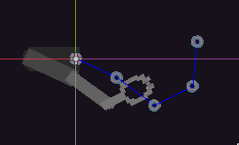
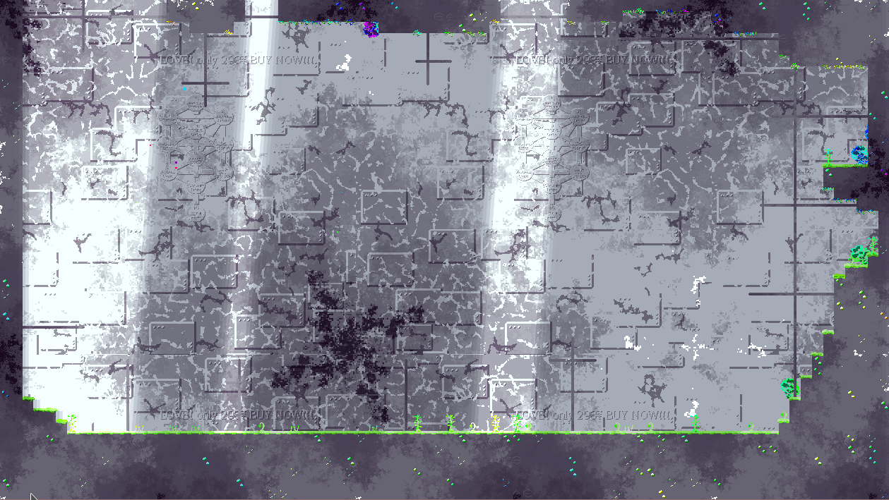

*2026-08-14*
# Update
lots of wondering not much proggers to be honest.
been jumping form mini project to another 
so just will list whats is currently in progress.

### PROC ANIMATION
> teh game will need a lot of it 

currently worknig on custom armeture system in godot which been fun but
also it made me creally aware of my lack of math knowalge.
currently i have no idea how to rotate nodes so they will align with armeture joints
and it makes me really annoyed.

### GRADIENT MAPPING
i have no idea if its called like that i've just made it up.
anyways the idea is to have texture and graddient palette 
using `red` channel as vertical offset into palette texture and,
`green` as value (horizotal offset) there is also `blue` that can 
be used as noise influance or smg like that. i'm using it for other small project 
ot test it out right now and it has some potential you porbaly just need better 
art skils than me

### OTHER
- looking into using lua in the project as smg to create scenes
- didn't touched rendering code cus OpenGL is really hard to understand
